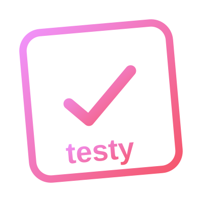

<p align="center">
  
</p>

<p align="center">
  <strong>English</strong> · <a href="README.pt-BR.md">Português (BR)</a>
</p>

# Testy

A testy, opinionated test management tool for QA teams that value simplicity over configuration. Create test plans, write scenarios in Given/When/Then format, generate scenarios with AI, attach evidence, and export PDF reports — nothing more, nothing less.

Most test management tools drown you in fields, workflows, and integrations before you can write your first test case. Testy takes the opposite approach: it gives you exactly what you need and stays out of the way.

## Features

- **Test Plans** — group related scenarios under a named plan assigned to a QA
- **Tags** — categorize plans with tags (e.g. "login", "sprint-23", "regressão") and search by them
- **Scenarios (Given/When/Then)** — structured Gherkin format without the overhead of a full framework
- **AI Scenario Generation** — describe a feature in plain text and let Gemini generate 5-15 test scenarios automatically, covering happy paths, edge cases, boundary values, and equivalence partitioning
- **Drag & Drop Reorder** — reorder scenarios by dragging them, with smooth FLIP animations and a visual drop zone; order is persisted and reflected in reports
- **Evidence Attachments** — upload screenshots and files directly on each scenario or bug
- **One-Click Approve/Reject** — mark scenarios as approved or failed inline
- **Derived Status** — plan status is computed automatically from its scenarios (no manual updates)
- **Bug Tracking** — report bugs with title, description, steps to reproduce, obtained vs expected results, and evidence attachments; tag by feature and root cause; mark as open or resolved
- **Bug ↔ Scenario Link** — associate failed scenarios with bugs; a scenario cannot be approved while a bug is linked to it
- **Root Causes Dashboard** — aggregated view of bugs grouped by cause tag and feature tag, with bar charts for quick analysis
- **Search & Filters** — search plans by name, QA, or tag; search bugs by ID, title, or description; filter by status, tags, and date range
- **Pagination** — paginated plan and bug listings for large datasets
- **PDF Reports** — export formatted reports for both test plans and individual bugs, with table of contents (clickable anchors), summary, scenarios, and evidence
- **Keyboard Shortcuts** — navigate quickly with single-key shortcuts (N for new, B for back, R for root causes, P for plans)
- **Authentication & Roles** — username/password login with admin and regular user roles; admins manage all plans and bugs, users manage their own
- **Bilingual (EN / PT-BR)** — full interface in English and Brazilian Portuguese; switch languages with one click, preference saved in cookie
- **REST API** — full JSON API with token authentication for test plans, scenarios, bugs, tags, and screenshot attachments
- **Testy CLI** — AI-powered command-line assistant that manages test plans, executes scenarios in the browser with Playwright, captures screenshots as evidence, and approves or rejects scenarios automatically — all from natural language commands

## Tech Stack

| Layer | Choice |
|-------|--------|
| Framework | Rails 8.1 |
| Ruby | 3.4+ |
| Database | SQLite |
| Frontend | Tailwind CSS v4, Hotwire (Turbo + Stimulus) |
| File Storage | Active Storage (local disk) |
| PDF | ferrum_pdf (Chrome headless) |
| AI | Gemini API (Google) |
| CLI | Claude Code + MCP (Model Context Protocol) |
| Browser Automation | Playwright MCP |
| Deploy | Kamal-ready (Docker + Thruster) |

## Getting Started

**Prerequisites:** Ruby 3.4+, Node.js (for Tailwind CSS build)

```bash
# Clone the repository
git clone https://github.com/VictorBitancourt/testy.git
cd testy

# Install dependencies
bundle install

# Setup database
bin/rails db:setup

# (Optional) Set Gemini API key for AI scenario generation
export GEMINI_API_KEY=your_key_here

# Start the server
bin/dev
```

Open [http://localhost:3000](http://localhost:3000). On first access, you'll be prompted to create the admin user.

## Running Tests

```bash
bin/rails test
```

Covers models, controllers, authentication, authorization, and filter behavior.

## Testy CLI

Testy includes an AI-powered command-line assistant that lets you manage test plans, execute scenarios in the browser, and capture evidence — all from natural language commands.

### Prerequisites

| Requirement | Purpose |
|---|---|
| Ruby 3.4+ and `bundle install` | Runs the Testy MCP server |
| Node.js and `npm install` | Playwright MCP for browser automation |
| Chromium or Chrome | Browser for screenshots and test execution |
| [Claude Code](https://docs.anthropic.com/en/docs/claude-code) | AI agent that powers the CLI |

### Setup

```bash
# Install Node.js dependencies (Playwright MCP)
npm install

# If Chromium is not at /usr/bin/chromium, set:
export CHROME_PATH=/path/to/chromium

# If the Testy server is running on a different address:
export TESTY_BASE_URL=http://192.168.1.x:3000

# Log in (creates a local token)
bin/testy login <username> <password>
```

### Usage

```bash
# Interactive mode
bin/testy

# Single command
bin/testy "List all test plans"

# Execute scenarios in the browser and capture evidence
bin/testy "Execute the scenarios of the 'System Login' plan on http://localhost:3000"
```

### What happens when you execute scenarios

1. The agent reads the scenario details (Given/When/Then)
2. Opens a browser with Playwright and performs the steps (navigate, click, type)
3. Captures a screenshot of the result and attaches it as evidence
4. Approves or rejects the scenario based on the outcome

### Other CLI commands

```bash
bin/testy logout   # Remove saved token
bin/testy whoami   # Check authentication status
```

### Environment variables

| Variable | Default | Description |
|---|---|---|
| `TESTY_BASE_URL` | `http://localhost:3000` | Testy server URL |
| `TESTY_MODEL` | `sonnet` | Claude model to use (`sonnet`, `opus`, `haiku`) |
| `CHROME_PATH` | Auto-detected | Path to Chromium/Chrome binary |

## How It Works

### Data Model

```
User (username, password_digest, role)
  |
  +-- Session (user_agent, ip_address)
  |
  +-- TestPlan (name, qa_name)
  |     |
  |     +-- TestScenario (title, given, when, then, status, position)
  |     |     |
  |     |     +-- Evidence Files (Active Storage)
  |     |     |
  |     |     +-- Bug (optional link)
  |     |
  |     +-- Tags (many-to-many via TestPlanTag)
  |
  +-- Bug (title, description, steps_to_reproduce, obtained_result, expected_result, status)
        |
        +-- Evidence Files (Active Storage)
        |
        +-- feature_tag, cause_tag (free-form tags with autocomplete)
        |
        +-- TestScenarios (linked failed scenarios)
```

### Derived Status

Plan status is not a stored field. It's computed from the scenarios:

| Status | Rule |
|--------|------|
| Not Started | Plan has zero scenarios |
| Approved | All scenarios are `approved` |
| Failed | At least one scenario is `failed` |
| In Progress | Has scenarios, none failed, but not all approved |

A scenario cannot be approved while it has a bug linked to it — the bug must be unlinked or resolved first.

### PDF Export

Each plan has an "Export PDF Report" button that generates a formatted document with:
- Table of contents with clickable anchors to each scenario
- Plan summary (total scenarios, approved count, QA name, tags)
- Each scenario with Given/When/Then steps and status
- Attached evidence images

Bugs also have individual PDF reports with description, steps to reproduce, obtained vs expected results, and evidence.

## Design Decisions

**No AND between Given, When, and Then.** This is intentional. Each step is a single text field — there's no way to chain multiple clauses with AND.

When tools allow AND, scenarios inevitably turn into click-by-click scripts:

> **Given** the user is on the login page  
> **And** the user has a valid account  
> **And** the browser is Chrome  
> **When** the user clicks the email field  
> **And** types "user@email.com"  
> **And** clicks the password field  
> **And** types "123456"  
> **And** clicks the submit button  
> **Then** the page redirects to /dashboard  
> **And** the welcome message is visible  
> **And** the session cookie is set  

This is not a test scenario — it's a manual test script. It's fragile, unreadable for non-technical stakeholders, and describes *how* instead of *what*.

Testy forces you to write scenarios that describe **behavior**, not **procedure**:

> **Given** a registered user  
> **When** they log in with valid credentials  
> **Then** they are redirected to the dashboard  

One Given, one When, one Then. If you can't describe the scenario in three concise sentences, it's probably more than one scenario. This keeps tests readable by both developers and business people, which is the whole point of Gherkin — a shared language, not a step recorder.

**SQLite in production.** One fewer service to manage. Works great for small-to-medium teams. Rails 8 supports it well with Solid Cache, Solid Queue, and Solid Cable.

**Simple authentication.** Testy uses Rails' built-in `has_secure_password` with username/password login. On first access, you'll be redirected to create the admin user — no seeds or setup scripts needed.

**No JavaScript build step.** Uses import maps for JS and the `tailwindcss-rails` gem for CSS. `bin/dev` runs both the server and the Tailwind watcher.

**Server-side filters.** Filtering happens via query params and SQL scopes — no client-side state, no JavaScript complexity, and every filtered view is a shareable URL.

## Deployment

### Docker Compose (recommended)

```bash
git clone https://github.com/VictorBitancourt/testy.git
cd testy
docker compose up -d
```

Open [http://localhost:3000](http://localhost:3000). On first access, you'll be prompted to create the admin user.

Data is persisted in a Docker volume (`testy_storage`). A `SECRET_KEY_BASE` is generated automatically on first boot.

To enable AI scenario generation, pass your Gemini API key:

```bash
GEMINI_API_KEY=your_key_here docker compose up -d
```

### Docker Run

```bash
docker run -d \
  -p 3000:80 \
  -e SOLID_QUEUE_IN_PUMA=true \
  -e FORCE_SSL=false \
  -e ASSUME_SSL=false \
  -e GEMINI_API_KEY=your_key_here \
  -v testy_storage:/rails/storage \
  testy:latest
```

## Password Reset

If a user forgets their password, an admin with server access can reset it:

```bash
bin/rails password:reset
```

The task will prompt for the username and a new password (input is hidden).

For Docker deployments:

```bash
docker exec -it <container_name> bin/rails password:reset
```

## Contributing

1. Fork the repository
2. Create your feature branch (`git checkout -b feature/my-feature`)
3. Make your changes and ensure tests pass (`bin/rails test`)
4. Commit your changes (`git commit -m 'Add my feature'`)
5. Push to the branch (`git push origin feature/my-feature`)
6. Open a Pull Request

## License

This project is open source under the [MIT License](LICENSE).
